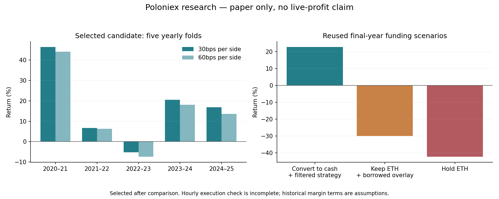

# Poloniex research and account integration — September 10, 2026

**Status: paper only. A promising retrospective candidate was found; live margin execution and execution-level validation remain incomplete.**

## Data

Archived all history returned by the current Poloniex API for the frozen 75-market liquid USDT universe: **3,175,633 hourly bars and 132,353 daily bars**, starting February 17, 2015. Archives contain per-page checkpoints, CSV SHA-256 hashes, manifests, and preserved malformed rows. Two malformed bars were quarantined at each granularity; 58 hourly and four daily discontinuities remain visible. No OHLC values were filled in. This is current-listed coverage, not a survivorship-free historical exchange universe. Historical order books and borrowing availability are not supplied by these archives.

## Experiments retained

| Experiment | Five-fold aggregate | Positive outer folds | Max drawdown |
|---|---:|---:|---:|
| Initial nested selection | 71.45% | 3/5 | 32.28% |
| Expanded regime/LightGBM selection | -2.87% | 2/5 | 35.14% |

The v1 final-year cash diagnostic returned +44.22%, but its outer-fold gate failed. The v2 procedure did worse overall. Those negative findings were retained; neither adaptive selection process was promoted. LightGBM did not beat the simpler fixed trend candidate consistently.

## Exploratory candidate

**20-day momentum, top three eligible assets, with Bitcoin above both its 50- and 200-day moving averages.** Each asset must also have positive 120-day momentum and at least 100,000 USDT trailing median daily volume. Weekly weights use a volatility budget and cash reserve; orders use next-day opens.

This candidate was selected after comparing 18 configurations on already viewed folds. Its metrics are **selection-biased research results**, not an untouched test or proof of future profit. The final year was reused after v1. The paper flag explicitly cannot enable live trading.

| Scenario | Five-fold aggregate | Positive folds | Max drawdown |
|---|---:|---:|---:|
| Base, 30bps per side | 108.38% | 4/5 | 17.36% |
| Doubled execution costs | 90.24% | 4/5 | 18.47% |
| One-day execution delay | 106.32% | 4/5 | 19.53% |
| Half the risk allocation | 45.68% | 4/5 | 9.03% |

Every tested single-market removal remained profitable; the lowest aggregate was **95.64%**. Removing ZEC produced **114.23%**. These are post-selection stress checks, not a correction for multiple comparisons.

| Outer interval | Candidate return | Doubled-cost return |
|---|---:|---:|
| 2020-09-09 to 2021-09-09 | 46.40% | 44.12% |
| 2021-09-09 to 2022-09-09 | 6.70% | 6.31% |
| 2022-09-09 to 2023-09-09 | -5.28% | -7.44% |
| 2023-09-09 to 2024-09-08 | 20.57% | 18.02% |
| 2024-09-08 to 2025-09-08 | 16.80% | 13.66% |

Aggregate returns compound five separately initialized, terminally closed yearly blocks. They are not annual returns or one continuously reconciled trading account.

## Hourly execution check — incomplete

The selected candidate was replayed against the hourly archive with weekly targets, a 10% trailing high stop, adverse gap fills, 40bps execution costs per side, and a cap of 0.1% of the preceding hour's quote volume. This is substantially stricter than the daily allocation study.

**One fold cannot be completed:** JST, LINK, SOL and XMR have missing held-price observations at 2023-10-30 03:00 UTC. A targeted API check also returned no LINK data for that hour at either hourly or 30-minute resolution. The simulator refuses to invent prices. Three of four completed folds were positive, but their partial aggregate must not be compared with the five-fold daily result. Stops and volume limits materially reduced modeled returns.

Consequently, the daily candidate is not execution-validated. A clean, complete execution test and independent forward paper evidence remain necessary before considering any live promotion.

## ETH and margin

Account initialization now supports actual priced ETH/spot inventory. It retains quantities rather than assigning fictional USDT proceeds; locked, unpriced and dust assets are excluded explicitly. A separate account-backed paper service uses this snapshot and an experimental Go momentum fallback. Its gradual conversions, limits, stops and holding rules differ from the weekly research portfolio, so the backtest return is not attributed to that service.

The read-only margin planner confirmed a 25-USDT proposal could use current ETH collateral. It consults current haircuts, free margin, maximum market size, and borrowing rates. The separate margin **paper** ledger models principal, stressed interest and repayment; an open/close simulation left roughly 0.14 USDT simulated residual debt from costs, while retaining the original ETH collateral. No real borrowing, conversion, order or transfer was submitted.

Holding full ETH exposure and borrowing for an overlay was worse in the reused final-year scenario: v2 modeled approximately **−29.92%**, versus **+22.80%** after converting to cash and using the filtered strategy. Margin amplifies the collateral exposure; it is not automatically more profitable. Historical borrow rates, margin eligibility and liquidation paths remain scenario assumptions.

The live spot executor can explicitly adopt existing holdings through `init-account` with all live switches. It still rejects borrowing and existing debt. Live margin execution is **not** enabled or claimed complete.

## Verification and artifacts

- Go race tests and vet cover funding, account mirroring, margin interest/repayment, depth aggregation, research live-mode rejection, archive quarantine/resumption, and existing order-reconciliation controls.
- Python tests cover causal returns, missing-price rejection, transaction funding, borrowed interest and terminal liquidation.
- Raw outputs: `data/research-nested-v1`, `data/research-nested-v2`, `data/research-matrix.json`, `data/research-robustness.json`, and `data/research-hourly-check-v2.json`.
- Forward state: `data/account-paper-v2/state.json`; margin simulation: `data/margin-paper/margin-paper.json`. These contain account information and are ignored by Git.

Public API references: [margin data](https://api-docs.poloniex.com/spot/api/public/margin), [private margin limits](https://api-docs.poloniex.com/spot/api/private/margin), [historical candles](https://api-docs.poloniex.com/spot/api/public/market-data).
